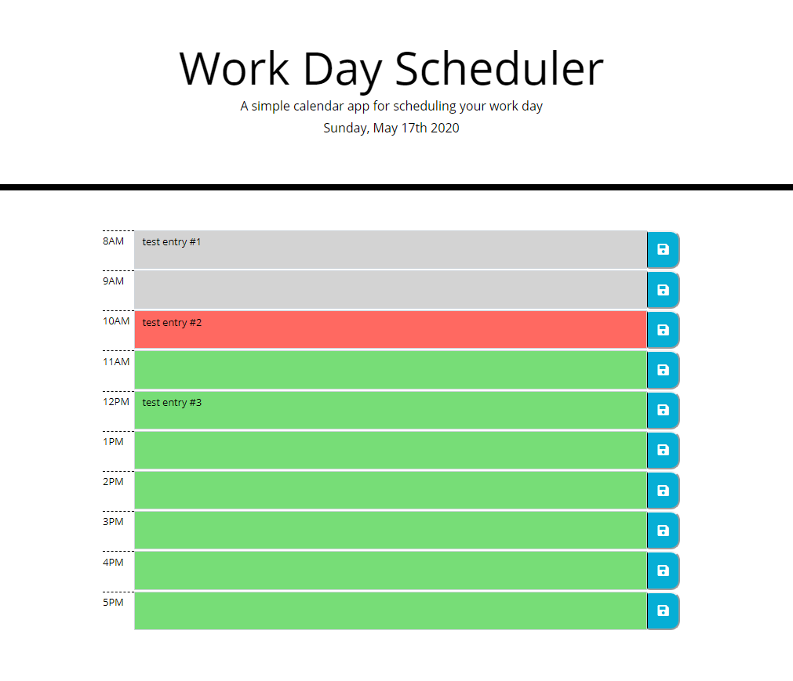

# Homework Assignment 5 - Work Day Scheduler

The purpose of this homework assignment was to create a simple calendar application that would allow a user to save events by the hour throughout a traditional business day. For this assignment, I set a work day to run between 8am through 5pm.

As specified in the homework assignment's instructions, the calendar application must:

- Run in the browser with a responsive layout.
- Feature dynamically updated HTML and CSS powered by JQuery.
- Use the [Moment.js](https://momentjs.com/) library within the browser.

## Links to Work Day Scheduler App and GitHub Repo

In the content below, I included links to (a) my work day scheduler app and (b) the associated GitHub repo that I used to develop this calendar app.

- GitHub Repo - [https://github.com/KEDuran/Work_Day_Scheduler](https://github.com/KEDuran/Work_Day_Scheduler)
- Link to Work Day Scheduler App - [https://keduran.github.io/Work_Day_Scheduler/](https://keduran.github.io/Work_Day_Scheduler/)

## Assignment Scope

In this section, I included the specific user story and acceptance criteria that was included in the homework instructions.

### User Story from Homework Instructions

```
AS AN employee with a busy schedule
I WANT to add important events to a daily planner
SO THAT I can manage my time effectively
```

### Acceptance Criteria from Homework Instructions

```
GIVEN I am using a daily planner to create a schedule
WHEN I open the planner
THEN the current day is displayed at the top of the calendar
WHEN I scroll down
THEN I am presented with timeblocks for standard business hours
WHEN I view the timeblocks for that day
THEN each timeblock is color coded to indicate whether it is in the past, present, or future
WHEN I click into a timeblock
THEN I can enter an event
WHEN I click the save button for that timeblock
THEN the text for that event is saved in local storage
WHEN I refresh the page
THEN the saved events persist
```

## Sample Screenshot of My Day Scheduler App

I included a screenshot of my day scheduler app below. Please note that this image was taken at a specific time, so due to dynamic nature of moment.js, the coloration of the textarea elements in the app may identically match the image included in this README.md file.


